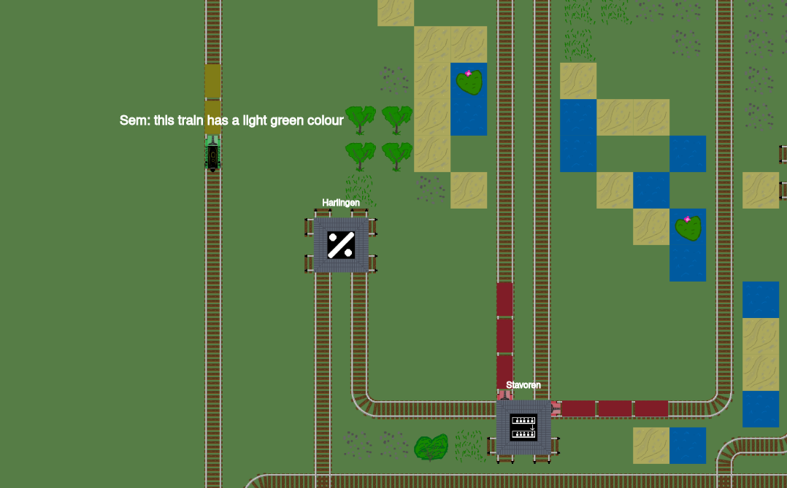
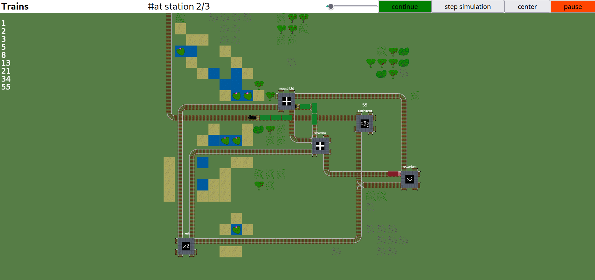
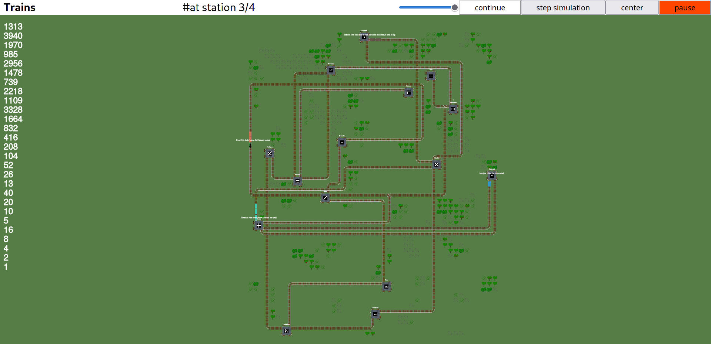

# Train

Train is a totally not esoteric programming language to help you with 
doing computations while you're on your way home in a train. 
Train models computation as train networks with trains moving through it
carrying two types of passengers. First class passengers who go to great 
lengths to describe the train they are in. Second class passengers
just try to get where they want to go and carry some data with them.

For some examples, please refer to the [shunting yard](shunting_yard)

# Creators:

This is the submission of Team Boole:
* Jonathan Dönszelmann <jonabent@gmail.com> (github: @jonay2000)
* Julius de Jeu <julius@voidcorp.nl> (github: @jonay2000)
* Jonathan Brouwer <jonathantbrouwer@gmail.com> (github: @jonathanbrouwer)
* Noah Jadoenathmisier <n.j.m.jadoenathmisier@student.tudelft.nl> (github: @noahiscool13)

# Compilation instructions
```bash
cargo run -- -shunting_yard/truth_machine.train
```
an optional argument (--cli / -c) can be added to run in headless mode.

This program uses python. By default, it calls the "python" executable, and expects at least
python 3.8. However, if your operating system sucks and only provides python 2 for instance,
or defaults to python 2 when python is called: set the "PYTHON_EXECUTABLE" environment
variable to your preferred python executable that's at least python3.8.

In this python install, be sure to add the following libraries:

* noise
* matplotlib
 
## Large programs
Large programs take a while to be layed out. They can also take a lot of memory to do so. 
While python runs, the memory usage is constantly printed, and when this value exceeds
PYTHON_MEMLIMIT (in kilobytes) the process is restarted until it succeeds. For small maps,
it may help to just restart (with `cargo run -- programname`) everything again until it 
succeeds. 

# LangJam

This programming language was written as a submission to the first LangJam
in the weekend of saturday the 21st of august 2021 by Jonathan Brouwer, Jonathan Dönszelmann,
Noah Jadoenathmisier, and Julius de Jeu.

# Additional Documentation
Imagine you are a Dutch student. You don't live in the same city as where your university is, and thus
must travel via train every morning. One morning before you board the train you get handed a card with
the number 16 on it, but are not informed what that number means. You do however notice that you are the
first person to board the train in second class. At the other side of the wall you can hear some people
in **first class** **commenting** on the train, "What a nice lime green color this train has." Someone else
responded "The yellow details are a nice addition as well yeah!" Confused you find a spot, and sit down.

At the first station, next to the name you see a big sign saying `ADD` underneath the station name. 
Suddenly a man runs at you from the train standing on track 2, he shouts: "Add 7 to your card!
It's important!" Not knowing what is going on, you sheepishly add 7 to your number, and the train
continues to the next station. 

At the second station you again see a big sign underneath the station name, this one saying `MUL`. 
you hear a man shout at you to multiply your number by 3. Again, not really knowing why you do this, 
you multiply your number. The train departs again, not really knowing what to expect. 

Just before you arrive at the station where you have to get off the train, you notice something.
There is no one else in the train? How did you not see this before? "That's pretty weird" you say to 
yourself. 

At your destination you again see a weird sign, this one saying `PRINT NUMBER`. When you get off
the train, a woman walks up to you, and asks you what your number is. "69?" you say. Suddenly the woman
shouts as loud as she can: "69!" Still not having any idea what this was about, you go on with your day. 

# First class passengers
While the second class passengers determine the data, first class passengers ("comments") influence the way the visualizer looks. They influence the color, length and accents of the train. 
Additionally, once every while the comment is shown as a message from the train.


# Interesting Programs
* incrementer.train outputs all numbers from 1 to infinity.
* fibonacci_simple.train outputs all fibonacci numbers, using a very simple circuit.
* fibonacci_complex.train outputs all fibonacci numbers, using a somewhat complex ciruit. This circuit looks quite nice, so this is the one we recommend running for testing.
  
* rock_paper_scissors.train is possible but difficult to get running. It allows two players to play rock paper scissors, and the program will determine the winner.
* fizzbuzz.train outputs all fizzbuzz values. It works in the CLI, but we have not gotten this running in the visualizer.
* colatz.train takes a numbers as input, and outputs the numbers sequence to collatz sequence of the number
  
* echo.train takes an input and outputs it immediately. Very simple, so useful for testing.
