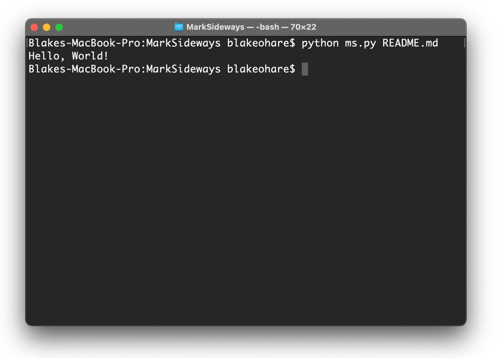

# Mark Sideways

MarkSideways is a programming language that uses MarkDown documents as its code file format.

This programming language was created as part of [LangJam](https://github.com/langjam/langjam). It is a solo project by [Blake O'Hare](https://github.com/blakeohare).

The overall structure of your program is determined by markdown structure such as headers and bulleted lists. The code is written in markdown triple-backtick (```) code blocks. Basically your code is one giant comment with bits of executable code specifially marked.

In fact, this entire `README.md` file is a Hello World example. You can run this document by running the following command:

> `$ python ms.py README.md`



**How it works**

A more comprehensive explanation can be found on the [documentation page](documentation.md).

All markdown text is a comment unless otherwise stated. The top-level header (i.e. the `#` header at the top) is the title of the program. Classes are defined by the existence of 2nd-level headers (i.e. the `##` headers). Methods are defined by 3rd-level headers (i.e. `###` prefixed headers). When full-block code snippet appear, the header they are listed under determines where they belong.

- Code snippets directly below the main header will be included as the initial execution, kind of like a `main()` function in most languages.
- Code snippets located directly under a 2nd-level header are part of the class' constructor.
- Code snippets located directly under a 3rd-level header are part of that method.
- Arguments are defined as bulleted lists with an inline code snippet of the argument name as its first text in the bulleted list item. The argument is associated with whichever entity it falls below.

Because this code is still part of the main header ("How it works" is just bold text, not a header) any code blocks listed here will run. There is a header below called "Example Code" and so that implies the existence of a class called ExampleCode. We can instantiate the class with the method `.init()`. We do so here...

```
ExampleCode.init();
```

## Example Code

This section of the document is the constructor of the Example Code class (class names, variables, and fields are case/space/punctuation insensitive to allow for natural language in the document comments, but consitent parsing in the code itself).

This constructor generates a message string. It does so by calling a helper method called `generateGreeting`. This helper method is defined in the next sub-heading. Once it has a message, it prints it to STDOUT using the built-in `print` function.

```
message = this.generateGreeting("World");
print(message);
```

### Generate Greeting

This sub heading is a method definition on the `Example Code` class. It contains one argument:

- `receiver` - the name of the person or entity to be greeted

Bulleted lists with an inline code snippet is how arguments are defined for methods. Now that `receiver` is defined, we can use it in code. This method just concatenates some strings to the receiver value and returns it.

```
return "Hello, " + receiver + "!";
```

### Language Syntax for snippets

The actual scripting portion of MarkSideways is somewhat common, as you can see from the code snippets above. It is modelled after a generic variety of curly-brace scripting languages so that it feels natural and somewhat familiar to most users. This project is mostly an exploration of what a "First Class Comment" would look like on a very high level more so than an exploration of new syntax details.

## Other Demos

There are a variety of demo code files in the `samples/` directory. You can run any of these samples by passing them to `ms.py` as-is. Remember, markdown **IS** the file format for marksideways. These are not just documentation readmes of these programs. These markdown files **ARE** the programs.

- **[Introduction](samples/Introduction.md)** - This is a similar Hello World program to the one embedded with this document, but covers more scenarios in more detail.
- **[Tetris](samples/Tetris.md)** - This is an implementation of Tetris using SDL2 (via PyGame since the interpreter is written in Python). It demonstrates how to create a game window, draw to the screen, and use input from the user.
- **[Calculate &pi;](samples/CalculatePi.md)** - This is a program that calculates &pi; by inscribing a circle in a square and choosing some number of random points within the square and seeing how many fall within the circle. The number of points can be passed in from the command line.
- **[Twitter Clone HTTP Server](samples/HttpServer.md)** - This is a **minimalistic** Twitter clone written with the MarkSideways HTTP Server library. It serves both static content for the frontend and also has a dynamic API endpoint for handling JSON requests.
- **[Rock Paper Scissors Showdown](samples/RockPaperScissors.md)** - A command-line implementation of Rock Paper Scissors that reads input from STDIN.

> You may be wondering *"If there's a heading called 'Other Demos' here, isn't that technically creating a class definition called OtherDemos?"* and the answer is **Yes**. Because there are no full-block code snippets in this heading and no sub-headings, this is technically an empty class definition with an empty constructor.

