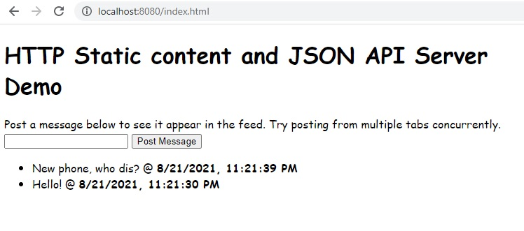

# HTTP Server Example

> As with all MarkSideways programs, this is *NOT* just a markdown file that refers to code. The markdown file itself *IS* the code that MarkSideways interprets. You can run this program by running `python ms.py samples/HttpServer.md [port number]`

This is a server that serves some HTML and JavaScript as the frontend (via GET requests) and has an API endpoint that handles JSON POST requests. This mimics a minimalistic Twitter where you can post messages and it periodically loads messages on the server and displays them along with the time they were posted.

When run and accessed on localhost, it looks like this:



This demo primarily utilizes two functions in the MarkSideways built-in library: `http_server_create_handler` &amp; `http_server_start`

To start, we determine the port number. If no port is specified as a command line argument, then we use `8080`.

```
if (args.length == 1) {
    portNum = parseInt(args[0]) ?? 8080;
} else if (args.length == 0) {
    portNum = 8080;
} else if (args.length > 0) {
    assert(false, "Incorrect number of arguments! Usage: marksideways HttpServer.md [port]");
}
```

Register handlers for all the static content.

> TODO: it'd be nice to have a favicon loaded from disk. This will require file I/O features in the built-in library.

```
files = getStaticFiles();
file_names = files.keys();
for i = 0 till file_names.length {
    name = file_names[i];
    content = files[file_names[i]];
    contentType = name == 'index.html' ? 'text/html' : 'text/javascript';
    http_server_create_handler('GET', '/' + name, SimpleStringResponseHandler.init(contentType, content).handle);
}
```

Add a method to handle the `/api` `POST` requests. Because we want to save some persistent data on the server, we need to instantiate a class to store this data on (since we don't have a database, this is all in-memory).

```
api = ApiEndpoint.init();
```

The `handler` method on the ApiEndpoint class is passed to the `http_server_create_handler` to handle the requests sent to `/api`.

```
http_server_create_handler('POST', '/api', api.handler);
```

Now that both the static content and API the handlers are registered, start the server! This function is blocking and so this is the end of the program.

```
http_server_start(portNum);
```

### Get Static Files

```
output = {};
```

This is the main HTML file. Currently it's just boilerplate and loads a `script.js` file.

```
output["index.html"] = '
<!DOCTYPE html>
<html>
    <head>
        <title>Sample HTTP Server with JSON API</title>
        <script src="/script.js"></script>
        <style type="text/css">
            body { font-family: "Comic Sans MS", "Papyrus", sans-serif; }
        </style>
    </head>
    <body onload="main()">
        <h1>HTTP Static content and JSON API Server Demo</h1>
        <div>Post a message below to see it appear in the feed. Try posting from multiple tabs concurrently.</div>
        <div>
            <input type="text" id="message"/>
            <button id="post">Post Message</button>
        </div>
        <ul id="feed"></ul>
    </body>
</html>
';
```

This is the JavaScript file. It sends the request, populates the feed, and periodically polls for new content.

```
output["script.js"] = "

const sendApiRequset = async (payload) => {
    let rawResult = await fetch('/api', {
        method: 'POST',
        body: JSON.stringify(payload),
    });
    let result = rawResult.json();
    if (result.error) {
        window.alert(result.error);
        return null;
    }
    return result;
};

const populateFeed = messages => {
    let feed = document.getElementById('feed');
    while (feed.firstChild) feed.removeChild(feed.firstChild);
    messages.reverse().forEach(msg => {
        let li = document.createElement('li');
        let content = document.createElement('span');
        let time = document.createElement('span');
        li.append(content, ' @ ', time);
        content.innerText = msg.text;
        let d = new Date(msg.time * 1000);
        time.innerText = d.toLocaleString();
        time.style.fontWeight = 'bold';
        feed.append(li);
    });
};

const main = () => {
    document.getElementById('post').addEventListener('click', async () => {
        let textField = document.getElementById('message');
        let text = textField.value;
        textField.value = '';
        let result = await sendApiRequset({
            action: 'ADD',
            text,
        });
        if (result) {
            populateFeed(result.messages);
        }
    });

    let doPoll = async () => {
        let result = await sendApiRequset({ action: 'LIST' });
        if (result) populateFeed(result.messages);
    };
    doPoll();
    setInterval(doPoll, 5000);
};
";
```

The content of these static files are returned as a dictionary:

```
return output;
```

## Api Endpoint

In the constructor for Api Endpoint, we create a brand new list. Remember, this is created before we start the server from handling requests so this only runs once. 

Requests that add messages will be added to this one list.
```
this.messages = [];
```

### Handler

This handles the incoming API requests.

- `method` - the HTTP method of the request
- `content` - the content of the request, if present

Since the content comes in as plain text, we must first parse it into JSON.
```
request = json_parse(content);
```
We go ahead and create a response object and add fields to it as appropriate.
```
output = {
    'echo': request,
};
```
We inspect the `action` field from the incoming JSON object and take appropriate action. Currently only two actions exist: `ADD` to add a new message to the list, and `LIST` to get a copy of the list. 

```
action = request.get('action');

if action == 'ADD' {
    this.messages.add({
        'text': request.get('text'),
        'time': floor(unix_time()),
    });
    output['messages'] = this.messages;
} else if action == 'LIST' {
    output['messages'] = this.messages;
} else {
    output['error'] = "Unknown action: " + action;
}
```

Once we're satisfied, we serialize the output to JSON and send back the requisite HTTP fields in a dictionary.

```
content = json_serialize(output);

return {
    'status': 'OK',
    'statusCode': 200,
    'contentType': 'application/json',
    'content': content,
};
```

## Simple String Response Handler

This handler object can be constructed with a specific file's content once and then return multiple times.

- `contentType` - the content type this handler should return
- `content` - the string value this handler will return

We save these fields in fields on this object.

```
this.contentType = contentType;
this.content = content;
```

### Handle

- `method` - the HTTP method of the requset
- `content` - the content of the request, if present

You must return a dictionary with the following keys: `status`, `statusCode`, `contentType`, `content`. The latter two are populated with the saved fields from earlier.
```
return {
    'status': 'OK',
    'statusCode': 200,
    'contentType': this.contentType,
    'content': this.content,
};
```

