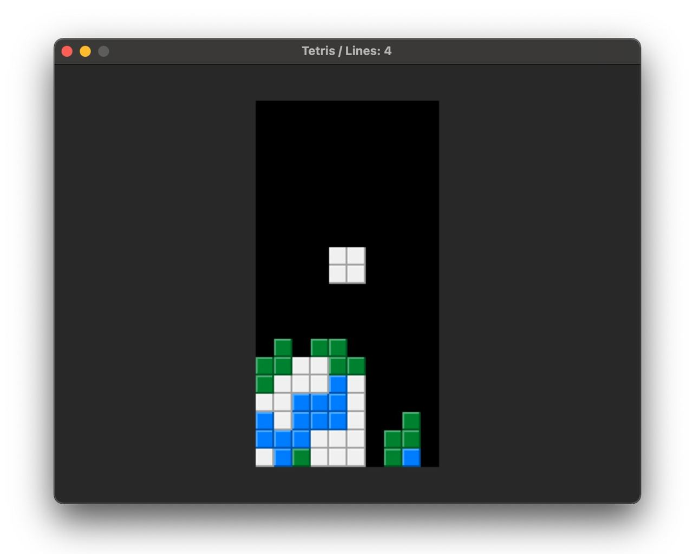

# Tetris



> As with all MarkSideways programs, this is *NOT* just a markdown file that refers to code. The markdown file itself *IS* the code that MarkSideways interprets. You can run this program by running `python ms.py samples/Tetris.md`

This document is an implementation of Tetris. It uses SDL2 (via PyGame since the interpreter is written in Python). To play, use the arrow keys to move the piece around. Push the down arrow to drop the piece quickly, and up arrow to turn it clockwise and spacebar to turn it counter-clockwise.

As you progress the pieces fall faster. Every 10 line clears moves you to the next level and the colors of the pieces change. You can see how many lines you've cleared in the title bar, which updates in real time.

To start things off, we create a new Tetris window using the `game_create_window` method:

```
game_create_window("Tetris", 640, 480, 30);
```

We then create a new instance of the object TetrisGameInstance.

```
game_instance = TetrisGameInstance.init();
```

We now see the main game loop. `game_is_quit()` will tell us if the user pressed the close button, `Ctrl + W`, or `Alt + F4`. `game_fill_screen` will fill the entire game window with a charcoal color and `game_get_events()` returns a list of strings that represent the key presses and releases that have occurred since the previous frame.
```
while !game_is_quit() {
    game_fill_screen(40, 40, 40);
    events = game_get_events();

```

We then call the update and render methods of our tetris game instance.

```
    game_instance.updatePhase(events);
    game_instance.renderPhase();
```

Finally, when we're done with this frame, we call `game_end_frame()` which tells SDL to refresh the screen and to pause a brief moment so that the frame rate runs at a constant rate.

```    
    game_end_frame();
}
```

### Make Grid

This is a helper function to create a 2-D array of a given width and height.

- `width` - width of the grid
- `height` - height of the grid

Of course with arrays, width and height are subjective since memory isn't spatial in this way. Throughout this program, the x coordinate will be considered to be the primary dimension and the y coordinate will be considered to be the secondary (nested) dimension.

```
cols = [];
for x = 1 thru width {
    col = [];
    for y = 1 thru height {
        col.add(0);
    }
    cols.add(col);
}
return cols;
```

## Tetris Game Instance

We now arrive at the constructor for the game instance itself. This sets the various persistent fields required for the game itself.

This is the main grid which is 10x20 cells (10 wide, 20 tall)
```
this.grid = makeGrid(10, 20);
```

These are the overlay fields. This represents a 4x4 grid overlay that can move around the grid containing the active piece. We start out with no piece.
```
this.overlay = null;
this.overlayX = 0;
this.overlayY = 0;
```

Some pieces do not spin and instead just tranpose each time you try to rotate them. The I-beam and square follow this pattern. This field will be set to true if the overlay contains either of those.
```
this.overlayUsesTranspose = false;
```

This keeps track of the total number lines that have been cleared so far. The level is calculated from this value.
```
this.linesCleared = 0;
```

This is a counter we update each frame to determine when it's time to let gravity move the active piece down by one space.
```
this.fallCounter = 0;
```

The following fields are used to run the clearing animation when you clear lines.
```
this.clearingCounterMax = 30;
this.clearingCounter = null;
this.clearingLines = null;
```

This is a list of various color themes for various levels. It's an array of arrays of arrays.
```
this.colorThemes = this.generateColorThemes();
```

### Apply Events
- `events` - list of key presses and releases since the last frame.

We loop through the events and take various actions based on the key that's pressed.

MarkSideways doesn't currently support foreach loops, and so we must loop from 0 till the length and dereference the events from the event list individually.

```
    for i = 0 till events.length {
        event = events[i];
```

When pressing left or right, we should attempt to adjust the overlay's x coordinate by -1 or 1. These methods check if there is no active overlay, so these calls are safe as-is.

```
        if event == 'left:press' {
            this.tryMoveOverlay(-1, 0);
        } else if event == 'right:press' {
            this.tryMoveOverlay(1, 0);
        }
```

Next we check if up was pressed or spacebar. These rotate the current piece clockwise and counter-clockwise. These methods will only work if the move is valid, so these are also safe as-is.

```
        else if event == 'up:press' {
            this.overlayRotate(true);
        } else if event == 'space:press' {
            this.overlayRotate(false);
        }
    }
```

> Note that pressing `down` is missing from this list. Because that's a continuous action rather than a one-time-when-the-key-is-first-touched event, there's a separate built-in method called `game_is_key_pressed` that will be used later.

### Update Phase

- `events` - list of key presses and releases since the last frame.

We first check to see if there's an active value in the `clearingCounter` field. This is an indication that lines are being cleared and an animation is running which should block all other upates and inpute.

```
if this.clearingCounter != null {
    this.performClearingLineUpdate();
}
```

In the next phase (the interactive phase) we first take all the keyboard events and apply them to the state....

```
else {
    this.applyEvents(events);
```

The remaining portion of the interactive phase update is for dropping the current overlay. If there isn't an overlay, create one!

```
    fallCounterStart = 30.0;

    if this.overlay == null {
        this.fallCounter = fallCounterStart;
        this.createNewOverlay();
    }

```

If the fall counter reaches 0, this means it's time to apply gravity. We use the same `tryMoveOverlay` method that moves the pieces from side-to-side to try to move the piece down. If it encounters a collision (indicated by the returned boolean), we know it's time to flatten the overlay onto the game grid and start anew. We also check to see if this causes any lines to become filled.

```
    if this.fallCounter <= 0 {
        this.fallCounter = fallCounterStart;
        if !this.tryMoveOverlay(0, 1) {
            this.flattenOverlay();
            this.overlay = null;
            this.checkForClearLines();
        }
    }
```
If the fall counter hasn't reached 0, then we should help it get there. We call a method called `getDropRate()` that determines how much the fallCounter should decrement by. This uses a few factors including the current level and whether the down arrow is currently pressed.

```
    else {
        this.fallCounter -= this.getDropRate();
    }
}

```

### TryMoveOverlay

- `dx` - the amount to move the overlay's x coordinate
- `dy` - the amount to move the overlay's y coordinate

Returns a boolean `true` if the move was successful, `false` if it ran into something
like a wall or another piece.

```
if this.overlay == null {
    return true;
}

this.overlayX += dx;
this.overlayY += dy;
if !this.isOverlayValid() {
    this.overlayX -= dx;
    this.overlayY -= dy;
    return false;
}
return true;
```

### Is Overlay Valid?

```
if this.overlay == null {
    return true;
}

for y = 0 till 4 {
    for x = 0 till 4 {
        color = this.overlay[x][y];
        if color > 0 {
            gx = x + this.overlayX;
            gy = y + this.overlayY;
            if gx < 0 || gy < 0 || gx >= 10 || gy >= 20 {
                return false;
            }
            if this.grid[gx][gy] != 0 {
                return false;
            }
        }
    }
}

return true;
```

### Get Drop Rate

This returns the a number that will be subtracted from a gravity counter. When the gravity counter reaches 0, then the piece drops by one cell. If this function returns a bigger number, it will appear to fall more quickly.

We start the rate at 2.0 because if it started at 0, then the pieces would not fall at all on level 0.
```
rate = 2.0;
```

We then add a value that grows with each level.
```
level = this.linesCleared / 10;
rate = 2.0 + level * 0.5;
```

Finally we check to see if the down arrow is pressed. If so, we make it fall really fast by adding 10.
```
rate += game_is_key_pressed('down') ? 10 : 0;
```

Once we have the final drop rate, we return it.

```
return rate;
```

### Flatten Overlay

This takes the current overlay values and flattens all the non-zero cells into the main game grid.

```
for y = 0 till 4 {
    for x = 0 till 4 {
        color = this.overlay[x][y];
        if color != 0 {
            this.grid[this.overlayX + x][this.overlayY + y] = color;
        }
    }
}
```

### Create New Overlay

This picks a new Tetris piece and creates a new overlay grid.

We start by choosing a random number from 0 through 6.

```
pieceId = floor(random_float() * 7);
```
We call a helper function that returns a list of 16 values that we can copy into the grid. This is why it's called `flat`.
```
flatOverlay = this.getPiece(pieceId);
this.overlay = makeGrid(4, 4);
for y = 0 till 4 {
    for x = 0 till 4 {
        this.overlay[x][y] = flatOverlay[y * 4 + x];
    }
}
```
We move the overlay coordinates to the top-center of the screen.
```
this.overlayX = 3;
this.overlayY = 0;
```

I-Beams and Squares do not rotate. They transpose in place. The piece ID for these is conveniently listed first as items 0 and 1.

```
this.overlayUsesTranspose = pieceId < 2;
```

### Get Piece

Given an ID# from 0 through 6, return a tetris piece in an array.

- `id` - The ID# of the piece, a number between 0 and 6 inclusive

The numbers in the array correspond to the color that should be used within the current level's theme. 1 is always white, and 2 and 3 are accent colors. 

**0: The I Beam**
```
if id == 0 {
    return [
        0, 1, 0, 0,
        0, 1, 0, 0,
        0, 1, 0, 0,
        0, 1, 0, 0,
    ];
}
```

**1: The Square**
```
else if id == 1 {
    return [
        0, 0, 0, 0,
        0, 1, 1, 0,
        0, 1, 1, 0,
        0, 0, 0, 0,
    ];
}
```

**2: The T Piece**
```
else if id == 2 {
    return [
        0, 1, 0, 0,
        1, 1, 1, 0,
        0, 0, 0, 0,
        0, 0, 0, 0,
    ];
}
```

**3: The S Piece**
```
else if id == 3 {
    return [
        0, 2, 0, 0,
        0, 2, 2, 0,
        0, 0, 2, 0,
        0, 0, 0, 0,
    ];
}
```

**4: The L Piece**
```
else if id == 4 {
    return [
        0, 2, 0, 0,
        0, 2, 0, 0,
        0, 2, 2, 0,
        0, 0, 0, 0,
    ];
}
```

**5: The Z Piece**
```
else if id == 5 {
    return [
        0, 3, 0, 0,
        3, 3, 0, 0,
        3, 0, 0, 0,
        0, 0, 0, 0,
    ];
}
```

**6: The Backwards L**
```
else if id == 6 {
    return [
        0, 3, 0, 0,
        0, 3, 0, 0,
        3, 3, 0, 0,
        0, 0, 0, 0,
    ];
}
```

> NOTE: These are returned in a flat array to keep the raw data fairly easy to read and oriented in the code itself to match the way it looks when rendered on the screen.

### Overlay Rotate

- `isClockwise` - a boolean indicating if the piece should be rotated clockwise

The implementation here is a transpose of the overlay followed by a flip for clockwise, and a flip followed by a transpose for counter-clocwise. This allows easy swap-based shuffling. If the current piece is marked with `overlayUsesTranspose = true`, then only use transpose without the flip (The I-beam and the square).

```
if this.overlay == null {
    return;
}

if this.overlayUsesTranspose {
    this.overlayTranspose();
    if !this.isOverlayValid() {
        this.overlayTranspose();
    }
    return;
}

if isClockwise {
    this.overlayTranspose();
    this.overlayFlip();
} else {
    this.overlayFlip();
    this.overlayTranspose();
}

if !this.isOverlayValid() {
    if isClockwise {
        this.overlayFlip();
        this.overlayTranspose();
    } else {
        this.overlayTranspose();
        this.overlayFlip();
    }
}
```

### Overlay Transpose

This transposes the current overlay matrix across the diagonal.

```
for y = 0 till 4 {
    for x = y + 1 till 4 {
        t = this.overlay[x][y];
        this.overlay[x][y] = this.overlay[y][x];
        this.overlay[y][x] = t;
    }
}
```

### Overlay Flip

This flips the current overlay matrix across the x = 1 axis. Note that this is effectively only swapping two columns and the 4th column is ignored. The 4th column is only used by the I-Beam and it uses tranpose-only. Flipping the first 3 columns creates a more natural feeling tetris rotation.

```
for y = 0 till 4 {
    t = this.overlay[0][y];
    this.overlay[0][y] = this.overlay[2][y];
    this.overlay[2][y] = t;
}
```

### Check for Clear Lines

To check for newly cleared lines, we loop through each row and track whether or not we see any gaps in it. If we do, break out of the loop for that row.

As we counter lines that are filled, we add them to an array called `linesToClear`.

```
    linesToClear = [];
    for y = 0 till 20 {
        hasHoles = false;
        for x = 0 till 10 {
            if this.grid[x][y] == 0 {
                hasHoles = true;
                break;
            }
        }
        if !hasHoles {
            linesToClear.add(y);
        }
    }
```

If we manage to not find any lines that need to be cleared, we're done! We don't know to take any further action and interactive mode can continue.

```
    if linesToClear.length == 0 {
        return;
    }
```

However, if we find any lines to clear, we should save this array for the animation and trigger it by setting the `clearingCounter` field to a non-null value.

```
    this.clearingLines = linesToClear;
    this.clearingCounter = 0;
```

### Perform Clearing Line Update

This function will slowly perform the line clearing animation frame-by-frame. We start by determining how far into the animation we are. We can do this by dividing the current clearingCounter by the maximum value for the counter.
```
progress = 1.0 * this.clearingCounter / this.clearingCounterMax;
```

Once we know how far into the animation we are, we decide how many cells we should erase from the left (animation clears from left to right)

```
clearThroughX = floor(progress * 10);
```
We then loop through each of the rows that's being cleared and set the cells to 0 that are up to `clearThroughX`.
```
for i = 0 till this.clearingLines.length {
    y = this.clearingLines[i];
    for x = 0 till clearThroughX {
        this.grid[x][y] = 0;
    }
}
```

If the counter reaches its maximum value, then it's time to do some housekeeping and return to interactive mode. 

We remove the lines and collapse the grid and insert new empty lines at the top (done mostly by Remove And Collapse Lines). We can also update the titlebar to indicate how many lines we've cleared so far. 

By setting the `clearingLines` field back to null, this indicates to the update phase that we are now back in interactive move and the animation is truly done.
```
if this.clearingCounter == this.clearingCounterMax {
    this.linesCleared += this.clearingLines.length;
    this.removeAndCollapseLines(this.clearingLines);
    this.clearingCounter = null;
    game_set_title("Tetris / Lines: " + this.linesCleared);
    this.clearingLines = null;
}
```

If we still have a ways to go, increment the `clearingCounter`.

```
else {
    this.clearingCounter++;
}
```

### Generate Color Themes

Each time you clear 10 lines, you move up a level. Each level has different colors. To define these configurations, we start by defining some re-usable colors.

```
WHITE = [240, 240, 240];
CERULEAN = [0, 128, 255];
GREEN = [0, 128, 50];
ORANGE = [255, 128, 0];
YELLOW = [255, 240, 0];
RED = [255, 0, 30];
PURPLE = [128, 0, 140];
MAGENTA = [255, 40, 255];
BLUE = [0, 0, 235];
LIME = [50, 255, 0];
BROWN = [128, 64, 0];
TAN = [200, 150, 100];
PINK = [255, 180, 225];
CYAN = [0, 255, 255];
```

Each level theme has 3 colors composed of white and two accent colors. This is a list of the accent colors by level. This list is finite, and so when higher levels are reached, they'll repeat.

```
themesByLevel = [
    [CERULEAN, GREEN],
    [ORANGE, YELLOW],
    [RED, PURPLE],
    [BLUE, MAGENTA],
    [GREEN, LIME],
    [BROWN, TAN],
    [PINK, YELLOW],
    [GREEN, PURPLE],
    [BLUE, CYAN],
    [ORANGE, RED],
];
```

We take the list of accent colors and do some processing on them. We join it up with `WHITE` and then compute tinted light and dark versions of each one. These color variations will be used to create textured bevels on all the blocks.

```
themes = [];
for i = 0 till themesByLevel.length {
    pair = themesByLevel[i];
    colors = [null, WHITE, pair[0], pair[1]];
    darkColors = [null];
    lightColors = [null];
    for j = 1 till colors.length {
        color = colors[j];
        r = color[0];
        g = color[1];
        b = color[2];
        darkColors.add([
            r * 2 / 3, 
            g * 2 / 3, 
            b * 2 / 3]);
        lightColors.add([
            255 - (255 - r) * 2 / 3,
            255 - (255 - g) * 2 / 3,
            255 - (255 - b) * 2 / 3]);
    }
```
Once we have the three color configurations for each of the color tints, we add them to a list. The index of this list will be the level number.

```
    themes.add([
        colors, darkColors, lightColors
    ]);
}

return themes;
```

### Remove and Collapse Lines

- `lines` - a list of the lines to remove

This shifts the lines designated by the y coordinates in the input argument list down to collapse the grid when these lines need to be removed.

We loop through the rows with two different pointers. One of the pointers is the actual final line number which starts from the bottom. We must start from the bottom so as to not accidentally overwrite cells we want to keep. 
```
actualLine = 19;
```

We loop backwards through every line whether or not we want to keep it. If the line number is the last line in the input list, we know we want to get rid of it. 

```
for y = 19 thru 0 {
    keepThisLine = lines.length == 0 || lines[lines.length - 1] != y;
    if !keepThisLine {
        lines.pop();
    }
```
If we keep the line, copy the values from the current row to the `actualLine` row. Move the `actualLine` pointer up by one.

```
    if keepThisLine {
        for x = 0 till 10 {
            this.grid[x][actualLine] = this.grid[x][y];
        }
        actualLine--;
    }
}
```
If we don't keep the line, we do nothing, including not decrementing `actualLine`. This means that when we get to the top, `acutalLine` will be lacking. We fill in the rest of the rows missing with 0's.

```
while actualLine >= 0 {
    for x = 0 till 10 {
        this.grid[x][actualLine] = 0;
    }
    actualLine--;
}
```

### Render Phase

This renders the Tetris Grid to the screen.

We first determine the dimensions and location of the grid:
```
tile_size = 20;
grid_width = tile_size * 10;
grid_height = tile_size * 20;
grid_left = (640 - grid_width) / 2;
grid_top = (480 - grid_height) / 2;
```

Next we figure out what colors to use when drawing the blocks, based on the current level.

```
level = this.linesCleared / 10;
colors = this.colorThemes[level % this.colorThemes.length];
fullColors = colors[0];
darkColors = colors[1];
lightColors = colors[2];
```

We draw a black background over the full dimensions of the grid.
```
game_draw_rectangle(grid_left, grid_top, grid_width, grid_height, 0, 0, 0);
```

Now we loop through each cell...
```

px = grid_left;
for x = 0 till 10 {
    py = grid_top;
    for y = 0 till 20 {
```
We check to see if the cell has a block in it. If the `blockId` is 0, we still need to check the overlay and see if that contains any cells. 
```
        colorId = this.grid[x][y];
        if colorId == 0 && this.overlay != null {
            if 
                x >= this.overlayX && 
                y >= this.overlayY && 
                x < this.overlayX + 4 && 
                y < this.overlayY + 4 {
                colorId = this.overlay[x - this.overlayX][y - this.overlayY];
            }
        }
```

If colorId is set to a non-zero value, that means that there's a block in either the grid or the overlay. For rendering, we don't care where it came from, just that we need to draw it to the screen...

```
        if colorId > 0 {
            rgb = fullColors[colorId];
            darkRgb = darkColors[colorId];
            lightRgb = lightColors[colorId];
```

We draw a series of 3 squares of slightly different sizes and offsets to create a shaded bevel effect for each block. The thickness of this bevel is 2 pixels.
```
            game_draw_rectangle(px, py, tile_size, tile_size, darkRgb[0], darkRgb[1], darkRgb[2]);
            game_draw_rectangle(px, py, tile_size - 2, tile_size - 2, lightRgb[0], lightRgb[1], lightRgb[2]);
            game_draw_rectangle(px + 2, py + 2, tile_size - 4, tile_size - 4, rgb[0], rgb[1], rgb[2]);
```
We update the pixel coordinates of the cell as we loop. 
```
        }
        py += tile_size;
    }
    px += tile_size;
}

```
