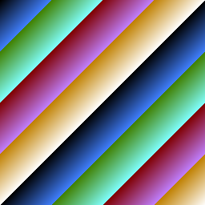

# Tag Language

A language embedded in Go struct tags. 

Go struct tags aren't *exactly* comments, but they are a comment-like extension of the core Go language that is often used in a lightly 1st class way to guide things like serialization.  

The Tag langauge takes this further, inventing a new and reasonably rich expression language inside struct tags, which is then embedded in a full "programming language" defined by just declaring Go struct types.  

The following analogies generally explain how Tag works:

* Structs are functions
* Fields are local variables
* Field types are statements, control flow and function calls
* Struct field tags are expressions in a made up new expression language

## Simple Example

Here's a simple program:

```go
type Color struct {
	R     int         `λ:"_0%256"`
	G     int         `λ:"_1%256"`
	B     int         `λ:"_2%256"`
	NRGBA color.NRGBA `λ:"R,G,B,255"`
}

type Image struct {
	Colors [256][256]Color `λ:"__0+__1,(__0+__1)*2,(__0+__1)*4"`
}
```

It renders this image:



## Conditionals and Recursion

Pointers are conditionals, and can be used to create recursion!

```go
type TraceRay struct {
	TraceRay *TraceRay `?:"_2>0" λ:"_0,_1,_2-1"`
}
```

## Memory, Stack and Execution History

The language has no stack frame unwinding or GC, so all local variables ever allocated are stored forever on the heap! :-).  This is interesting, because it means once a program completes, the returned result value is a full execution trace.  For example, the test that validates the behaviour of `TraceRay` above is able to validate it after the fact via `assert.Nil(t, res.(TraceRay).TraceRay.TraceRay.TraceRay)` - verifying that there were indeed 3 layers of recusrive calls made, and that the last was `nil`.

## RayTracer Example

The current goal is to be able to write a raytracer in this "language".  The following early subset is a larger program that is working so far (though still missing some major pieces to implement the full raytracer!):

```go
// Vector(x, y, z)
type Vector struct {
	X float64
	Y float64
	Z float64
}

// VectorTimes(v1, x)
type VectorTimes struct {
	Vector `λ:"_0.X*_1,_0.Y*_1,_0.Z*_1"`
}

// VectorPlus(v1, v2)
type VectorPlus struct {
	Vector `λ:"_0.X+_1.X,_0.Y+_1.Y,_0.Z+_1.Z"`
}

// VectorMinus(v1, v2)
type VectorMinus struct {
	Vector `λ:"_0.X-_1.X,_0.Y-_1.Y,_0.Z-_1.Z"`
}

// VectorDot(v1, v2)
type VectorDot struct {
	Value float64 `λ:"(_0.X*_1.X)+(_0.Y*_1.Y)+(_0.Z*_1.Z)"`
}

// VectorNorm(v)
type VectorNorm struct {
	Dot         VectorDot `λ:"_0,_0"`
	VectorTimes `λ:"_0,1.0/(Dot.Value^0.5)"`
}

// Ray(start, dir)
type Ray struct {
	// TODO: Avoid need to copy, perhaps by leaving off expression
	Start Vector `λ:"_0.X,_0.Y,_0.Z"`
	Dir   Vector `λ:"_1.X,_1.Y,_1.Z"`
}

// IntersectSphereDist(radius, eo, v)
type IntersectSphereDist struct {
	EODotEO VectorDot `λ:"_1,_1"`
	Disc    float64   `λ:"(_0^2)-(EODotEO.Value-_2^2)"`
	Value   *float64  `?:"0<Disc" λ:"_2-(Disc^0.5)"`
}

// IntersectSphere(ray)
type IntersectSphere struct {
	Center Vector               `λ:"0,0,0"`
	Radius float64              `λ:"1"`
	EO     VectorMinus          `λ:"Center,_0.Start"`
	V      VectorDot            `λ:"EO,_0.Dir"`
	VDist  *IntersectSphereDist `?:"0<V.Value" λ:"Radius,EO,V.Value"`
	Dist0  *float64             `?:"VDist" λ:"VDist.Value?0"`
	Dist   float64              `λ:"Dist0?0"`
}

// TraceRay(scene, ray, depth)
type TraceRay struct {
	// TODO: Sphere intersection, and then compute color from intersection
	// Isect    IntersectSphere `λ:"_1"`

	TraceRay *TraceRay `?:"_2>0" λ:"_0,_1,_2-1"` // Recursion!!!
}

// TracePixel(camera, x, y)
type TracePixel struct {
	RecenterX      float64     `λ:"(128.0-_1)/512"`
	RecenterY      float64     `λ:"(_2-128.0)/512"`
	Right          VectorTimes `λ:"_0.Right,RecenterX"`
	Up             VectorTimes `λ:"_0.Up,RecenterY"`
	RightUp        VectorPlus  `λ:"Up,Right"`
	RightUpForward VectorPlus  `λ:"RightUp,_0.Forward"`
	Point          VectorNorm  `λ:"RightUpForward"`
	Ray            Ray         `λ:"_0.Pos,Point"`
	Color          TraceRay    `λ:"_0,Ray,0"`
}

// Raytracer(camera)
type Raytracer struct {
	Pixels [256][256]TracePixel `λ:"_0,__0,__1"`
}

// Camera(up, right, forward)
type Camera struct {
	// TODO: Compute from pos and lookAt instead
	Up      Vector `λ:"_0.X,_0.Y,_0.Z"`
	Right   Vector `λ:"_1.X,_1.Y,_1.Z"`
	Forward Vector `λ:"_2.X,_2.Y,_2.Z"`
	Pos     Vector `λ:"_2.X,_2.Y,_2.Z"`
}

// Main()
type Main struct {
	Up        Vector    `λ:"0,0,1"`
	Right     Vector    `λ:"0,1,0"`
	Forward   Vector    `λ:"1,0,0"`
	Camera    Camera    `λ:"Up,Right,Forward"`
	Raytracer Raytracer `λ:"Camera"`
}
```

## Build and Run

To run the simple program above that renders a rainbow image:

```bash
$ cd structtaglang
$ go run .
```

To run tests which include the subsets of the raytracer implemention:

```bash
$ cd structtaglang
$ go test .
```

## Implementation

There's an AST for the tag expression language in [`ast.go`](./structtaglang/ast.go).  There's a very rough recursive descent parser for that AST in [`ast.go`](./structtaglang/parser.go).  This uses the default `text/scanner` tokenizer available in Go.  The evaluator in [`eval.go`](./structtaglang/ast.go) includes both expression evaluation for the tag language, as well as the structure of how to evaluate structs (functions) in a type-directed way based on their fields, field types, and tags. 

## TODO

- [x] Pointer types as `if` - something like `Something *int` with `λ:"_0>0=>_0"`
- [ ] Slice types as `map` - something like `Something []int` with `λ:"Colors=>__0[0].R"` which maps a variable `Colors` into a slice of ints.
- [ ] Combination of pointers and slices to filter a map?
- [x] Null coalescing
- [ ] Array indexing
- [ ] Data paralellism
- [ ] Static analysis and type checking
