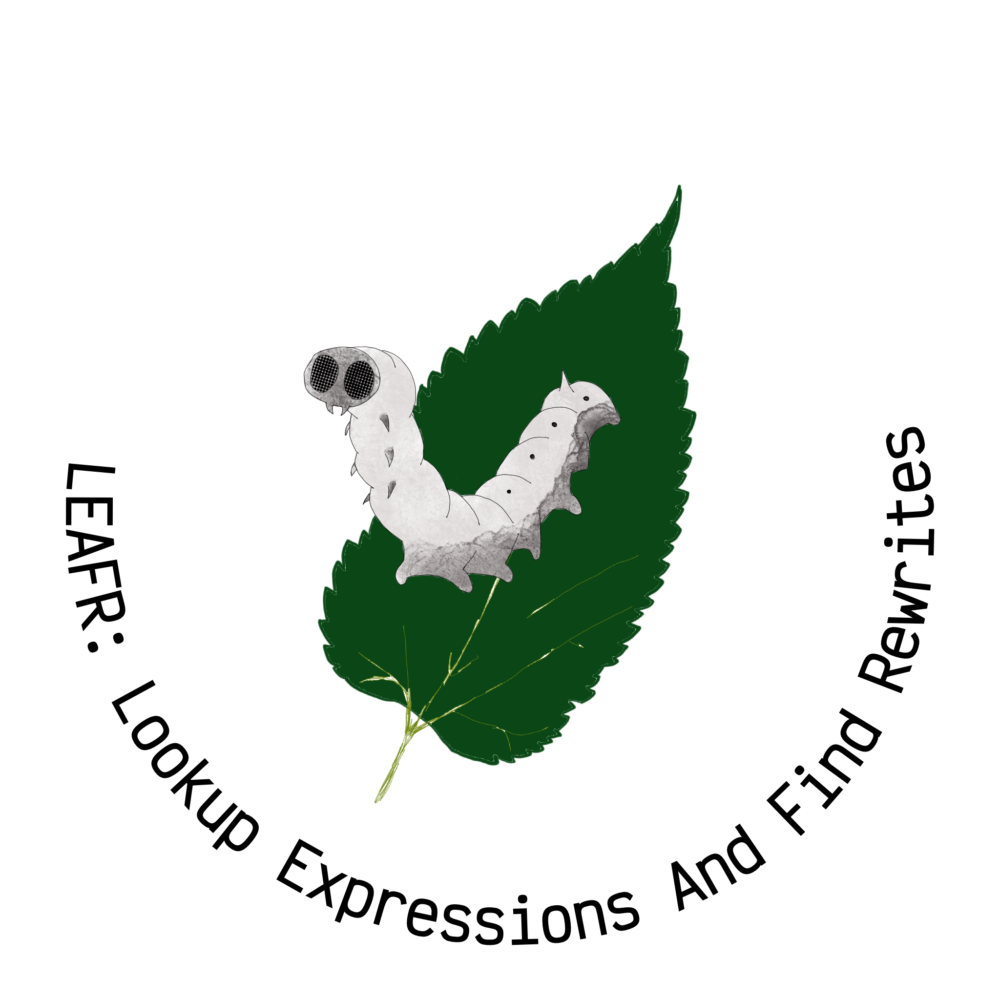

# Leafr: Lookup Expressions And Find Rewrites

Leafr is a language based on pattern matching and string rewriting. Created for Langjam 2021 under the theme
"first-class comments", the language aims to treat comments as first class by allowing data to be provided
in the form of written prose.

It's inspired by [Refal](https://en.wikipedia.org/wiki/Refal).

## How to Run

Leafr is written in Ruby 2.6.3.

  ```
  Usage: ruby leafr.rb [options]
    -r, --run FILE                   The path of a file to run
    -d, --debug                      Enable debug printing
    -p, --play                       Play a terminal animation of the code running
    -t, --tests                      Run the test suite used to develop the language
    -h, --help                       Display this help
  ```


## First class comments

When we considered what "first class comments" could mean, they idea came to us that this would mean
comments are a core part of the logic of a program. What if you could write comments in your code,
and have a series of rules fill in the logic behind them? Here is an example of that in Leafr


```
function my_function(str) {
  // call the reverse method on "str" and print that out
  // do all of that 10 times
}
-------------

// call the <X> method on "<Y>"
  <Y>.<X>()

<>  <X> and print that out
  <>  console.log(<X>)

{<A>// do all of that <X> times<Z>}
  {
    for (let i = 0; i < <X>; i++) {
       <A>
    }
    <Z>
  }
```

yields

```

function my_function(str) {
  for (let i = 0; i < 10; i++) {
     
  console.log(str.reverse())
  
  }
  

}
```

## Syntax

The syntax of Leafr is very simple. All files are broken into two sections, the "data" and the "code". These sections are separated by at least three `-` characters, like this.

```
Here is the data
---
Here are the
  rules
```

Rules are the only control construct in Leafr. A rule is a simple find and replace. Every line that begins with no spaces is part of a "rule header", and defines the pattern that will be matched. Following lines indended by two spaces define the rewrite. For example:

```
Hello
World
--------
Hello
  Goodbye
```

will yield 

```
Goodbye
World
```

The syntax `<A>` defines a pattern. Patterns can be used in both headers and rewrites. Any patterns matched in the header can be used in the rewrite. So

```
Hello
World
-----
Hello
<X>
  Goodbye
  <X>
```

is equivalent to the above.

If a pattern is a lower case letter, it will match only one character. Otherwise it matches N or more charaters, including whitespace.

The pattern `<>` is removed before a rule is run. IT can be used in cases where a rule would otherwise parse incorrectly, or as a placeholder to make whitespace obvious.

Leafr is a turing complete language, as shown by the gif above implementing Rule 110.


## Matching rules

Rewrites are chosen based on the following rule order

- Shortest rewrite
- Fewest variable substitutions
- Defined order

## Samtara Team Members

* [@sabrinathecodewitch](https://github.com/sabrinathecodewitch)
* [@samdoiron](https://github.com/samdoiron)


